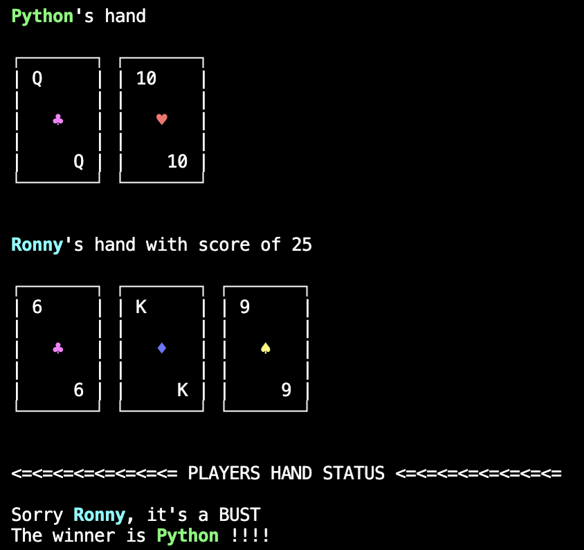
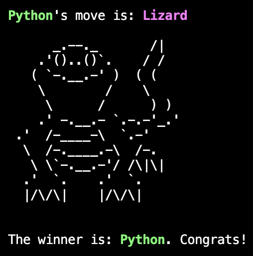
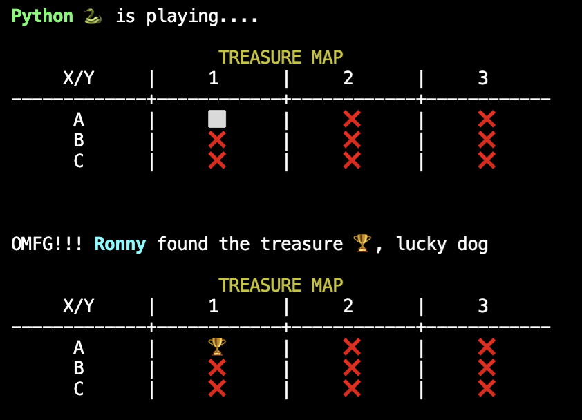
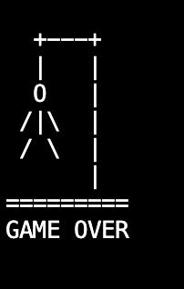

# pygame

Welcome to Pygame, your hub for time killing, meaningless games 😜 

This repo is part of my 100 days - 100 python projects

## Before you start
- Please use python 3.10 or above
- Make sure you have pip installed (https://pypi.org/project/pip/)
- Easily install the requirements:
```
python3 -m pip install -r requirements.txt
```

activate the game hub by running ```python3 play.py```

## The games

### 1. Blackjack - It's you against Python



### 2. Rock Paper Scissors Lizard Spock - the Big bang theory version 🖖



### 3. Treasure Map - Try finding the hidden treasure before Python



### 4. Hang Non-Binary Person - the same game, adjusted to 2024 🙄


### 5. Brain Quiz - Test your knowledge about a variety of subjects


